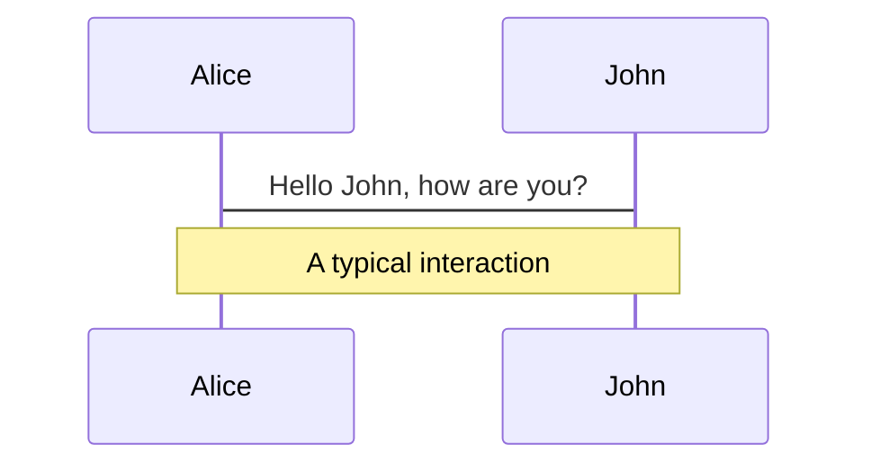
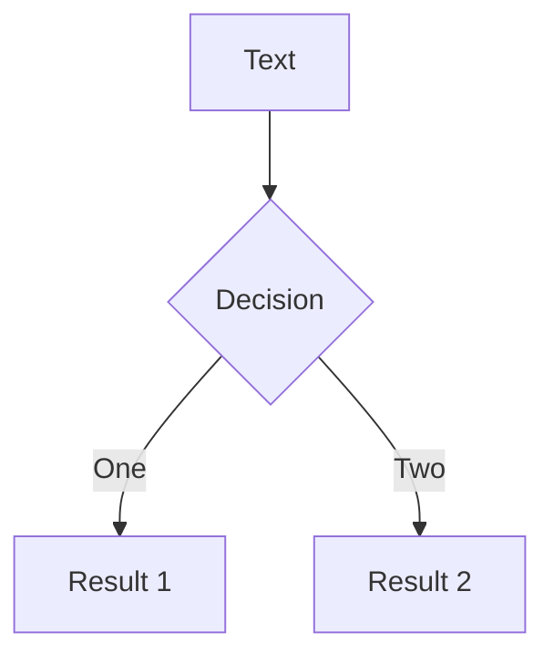
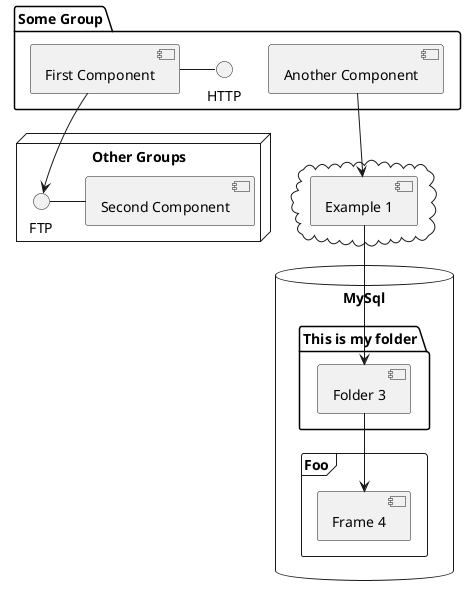

# 問 Svelte

使用 AI 以任何語言搜索知識庫

<div class="pt-12">
  <span @click="$slidev.nav.next" class="px-2 py-1 rounded cursor-pointer" hover="bg-white bg-opacity-10">
    按空格鍵下一頁
    <!-- Press Space for next page  -->
    <carbon:arrow-right class="inline"/>
  </span>
</div>

<div class="abs-br m-6 flex gap-2">
  <!-- <button @click="$slidev.nav.openInEditor()" title="Open in Editor" class="text-xl slidev-icon-btn opacity-50 !border-none !hover:text-white">
    <carbon:edit />
  </button> -->
  <a href="https://github.com/jacob-8/ask-svelte-presentation" target="_blank" alt="GitHub"
    class="text-xl slidev-icon-btn opacity-50 !border-none !hover:text-white">
    <carbon-logo-github />
  </a>
</div>

<!--
了解我如何使用 OpenAI 和 SvelteKit 為 Svelte 文檔站點構建類似 ChatGPT 的多語言對話搜索。
了解我如何使用 Firebase Auth 保護我的 API，並獲得一些關於如何使用 Firebase 為您自己或您的公司創建多語言搜索工具的想法。 https://sli.dev/guide/syntax.html#notes
-->

---

# 搜索演示


[polylingual.dev/zh-TW/search](https://polylingual.dev/zh-TW/search)

---
layout: iframe-right
url: https://polylingual.dev
---

# 搜索演示

- <logos-svelte-icon /> **搜索知識庫** - 搜索 Svelte 官方文檔
- 🤖 **使用 AI** - 使用 OpenAI GPT-3
- 🤹 **任何語言** - 它將使用相同的語言回复
<!-- - 📖 -->

95+ 語言: <span class="text-blue">**繁體中文**</span>、簡體中文、英語、日語、韓語、印度尼西亞語、西班牙語、法語、德語、阿拉伯語、荷蘭語、越南語、泰語、阿爾巴尼亞語、亞美尼亞語、阿瓦迪語、阿塞拜疆語、巴什基爾語、巴斯克語、白俄羅斯語、孟加拉語、博傑普爾語、波斯尼亞語、巴西語 葡萄牙語、保加利亞語、加泰羅尼亞語、恰蒂斯加爾希語、克羅地亞語、捷克語、丹麥語、多格里語、愛沙尼亞語、法羅語、芬蘭語、加利西亞語、格魯吉亞語、希臘語、古吉拉特語、哈里亞納語、印地語、匈牙利語、愛爾蘭語、意大利語、爪哇語、卡納達語、克什米爾語、邁蒂利語、馬來語、廣東話、吳語、等

<!-- Source: https://seo.ai/blog/how-many-languages-does-chatgpt-support -->

---

# Use Cases

Create a highly proficient chat assistant for your:

- company internal knowledge base
- product documentation
- personal knowledge base

---

# 怎麼構建知識庫搜索

- <clarity-process-on-vm-line inline /> Preprocess Knowledge Base and Create Embeddings using OpenAI
- <carbon-search /> Receive search query from the user
  <!-- - This will send a query to our backend and listen for answers -->
- <carbon-bare-metal-server /> Create SvelteKit back-end API endpoint 
  - <carbon-3d-print-mesh /> Create embedding of user's query
  - <fluent-mdl2-documentation /> Use embeddings to find most relevant documentation sections
  - <carbon-chat /> Send documentation context and user's question to OpenAI
  - <fluent-stream-output-20-regular /> Stream answer back to user
- <mdi-message-text-fast-outline /> Display answer in the front-end
- <logos-firebase/> Secure with Firebase Auth
  <!-- - Create a Firebase Project
  - Add multilingual Firebase Auth to a SvelteKit web app using SvelteFireTS -->


---

# 未來的任務

- <logos-firebase/> 將問題和答案保存到 Firestore
- 計數使用
- 如果您的知識庫很大並且您想快速檢索最相關的文檔部分，您可以使用 [Google Cloud Matching Engine Vertex AI](https://cloud.google.com/blog/topics/developers-practitioners/find-anything-blazingly-fast-googles-vector-search-technology) 或任何 [OpenAI 建議的矢量數據庫](https://platform.openai.com/docs/guides/embeddings/how-can-i-retrieve-k-nearest-embedding-vectors-quickly)

<!-- This will allow users to view their history and you can provide cached answers to nearly identical questions. -->

---

# 了解更多

- <carbon-logo-github /> 查看源代碼: [**polylingual.dev**](https://github.com/jacob-8/polylingual.dev)
<br />

- [OpenAI Introducing text and code embeddings](https://openai.com/blog/introducing-text-and-code-embeddings/), [OpenAI Emebeddings Documentation](https://platform.openai.com/docs/guides/embeddings/what-are-embeddings)
- [Storing OpenAI embeddings in Postgres with pgvector](https://supabase.com/blog/openai-embeddings-postgres-vector), [Supabase Clippy: ChatGPT for Supabase Docs](https://supabase.com/blog/chatgpt-supabase-docs)
- [Nearest Neighbor Search](https://towardsdatascience.com/using-approximate-nearest-neighbor-search-in-real-world-applications-a75c351445d)
- [Vertex AI Matching Engine overview](https://cloud.google.com/vertex-ai/docs/matching-engine/overview)
- [Visualize Embeddings](https://nnext.ai/wiki/Visualizing-ChatGPT-embeddings-2ecbf1423280479fa6f303c3343a49a1)
- [sqlite-vss: A SQLite Extension for Vector Search](https://observablehq.com/@asg017/introducing-sqlite-vss)

---

# 聯繫我

- <logos-facebook/> [了解 JavaScript 高雄社團](https://www.facebook.com/groups/liaojiejavascript)
  - 每週一晚上七點到九點我們開會。
- <logos-twitter/> [@jacobbowdoin](https://twitter.com/jacobbowdoin)

---
layout: image-right
image: https://source.unsplash.com/collection/94734566/1920x1080
---

# Code

Use code snippets and get the highlighting directly![^1]

```ts {all|2|1-6|9|all}
interface User {
  id: number
  firstName: string
  lastName: string
  role: string
}

function updateUser(id: number, update: User) {
  const user = getUser(id)
  const newUser = { ...user, ...update }
  saveUser(id, newUser)
}
```

<arrow v-click="3" x1="400" y1="420" x2="230" y2="330" color="#564" width="3" arrowSize="1" />

[^1]: [Learn More](https://sli.dev/guide/syntax.html#line-highlighting)

<style>
.footnotes-sep {
  @apply mt-20 opacity-10;
}
.footnotes {
  @apply text-sm opacity-75;
}
.footnote-backref {
  display: none;
}
</style>

---

# Components

<div grid="~ cols-2 gap-4">
<div>

You can use Vue components directly inside your slides.

We have provided a few built-in components like `<Tweet/>` and `<Youtube/>` that you can use directly. And adding your custom components is also super easy.

```html
<Counter :count="10" />
```

<!-- ./components/Counter.vue -->
<Counter :count="10" m="t-4" />

Check out [the guides](https://sli.dev/builtin/components.html) for more.

</div>
<div>

```html
<Tweet id="1390115482657726468" />
```

<Tweet id="1390115482657726468" scale="0.65" />

</div>
</div>

<!--
Presenter note with **bold**, *italic*, and ~~striked~~ text.

Also, HTML elements are valid:
<div class="flex w-full">
  <span style="flex-grow: 1;">Left content</span>
  <span>Right content</span>
</div>
-->


---
class: px-20
---

# Themes

Slidev comes with powerful theming support. Themes can provide styles, layouts, components, or even configurations for tools. Switching between themes by just **one edit** in your frontmatter:

<div grid="~ cols-2 gap-2" m="-t-2">

```yaml
---
theme: default
---
```

```yaml
---
theme: seriph
---
```


</div>

Read more about [How to use a theme](https://sli.dev/themes/use.html) and
check out the [Awesome Themes Gallery](https://sli.dev/themes/gallery.html).

---
preload: false
---

# Animations

Animations are powered by [@vueuse/motion](https://motion.vueuse.org/).

```html
<div
  v-motion
  :initial="{ x: -80 }"
  :enter="{ x: 0 }">
  Slidev
</div>
```

<div class="w-60 relative mt-6">
  <div class="relative w-40 h-40">
    
    
    
  </div>

  <div
    class="text-5xl absolute top-14 left-40 text-[#2B90B6] -z-1"
    v-motion
    :initial="{ x: -80, opacity: 0}"
    :enter="{ x: 0, opacity: 1, transition: { delay: 2000, duration: 1000 } }">
    Slidev
  </div>
</div>

<!-- vue script setup scripts can be directly used in markdown, and will only affects current page -->
<script setup lang="ts">
const final = {
  x: 0,
  y: 0,
  rotate: 0,
  scale: 1,
  transition: {
    type: 'spring',
    damping: 10,
    stiffness: 20,
    mass: 2
  }
}
</script>

<div
  v-motion
  :initial="{ x:35, y: 40, opacity: 0}"
  :enter="{ y: 0, opacity: 1, transition: { delay: 3500 } }">

[Learn More](https://sli.dev/guide/animations.html#motion)

</div>

---

# LaTeX

LaTeX is supported out-of-box powered by [KaTeX](https://katex.org/).

<br>

Inline $\sqrt{3x-1}+(1+x)^2$

Block
$$
\begin{array}{c}

\nabla \times \vec{\mathbf{B}} -\, \frac1c\, \frac{\partial\vec{\mathbf{E}}}{\partial t} &
= \frac{4\pi}{c}\vec{\mathbf{j}}    \nabla \cdot \vec{\mathbf{E}} & = 4 \pi \rho \\

\nabla \times \vec{\mathbf{E}}\, +\, \frac1c\, \frac{\partial\vec{\mathbf{B}}}{\partial t} & = \vec{\mathbf{0}} \\

\nabla \cdot \vec{\mathbf{B}} & = 0

\end{array}
$$

<br>

[Learn more](https://sli.dev/guide/syntax#latex)

---

# Diagrams

You can create diagrams / graphs from textual descriptions, directly in your Markdown.

<div class="grid grid-cols-3 gap-10 pt-4 -mb-6">







</div>

[Learn More](https://sli.dev/guide/syntax.html#diagrams)

---
src: ./pages/multiple-entries.md
hide: false
---

---
layout: center
class: text-center
---

# Learn More

[Documentations](https://sli.dev) · [GitHub](https://github.com/slidevjs/slidev) · [Showcases](https://sli.dev/showcases.html)
